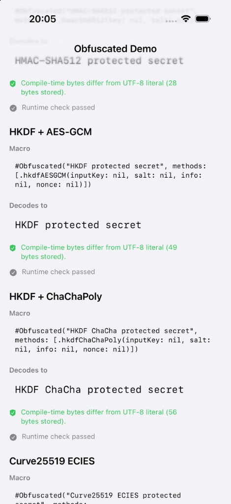

# Obfuscated

Compile-time string obfuscation for Swift via freestanding macros.

Use `#Obfuscated("secret", methods: [...])` and get a normal `String` back — no wrapper type, no manual decode, no extra setup. Obfuscation happens at build time; the rest of your code treats the value like any other string.

## Showcase

The included demo app exercises every built-in obfuscation method plus a custom ROT13 step, and verifies compile-time bytes differ from the plain UTF-8 literal.

<p align="center">
  
</p>

Open [`Demo/ObfuscatedDemo.xcodeproj`](Demo/ObfuscatedDemo.xcodeproj) to run the catalog on iOS or macOS. The app imports **ObfuscatedDemoKit** from the local package at [`Demo/ObfuscatedDemoSupport`](Demo/ObfuscatedDemoSupport/) — not the root `Obfuscated` product directly — so custom steps work in the demo.

## Requirements

- Swift 6.2+
- macOS 15+, iOS 14+, tvOS 14+, watchOS 7+, macCatalyst 14+
- Xcode 16+ (macro plugin support)

## Installation

Add the package to `Package.swift`:

```swift
dependencies: [
    .package(url: "https://github.com/tomisacat/Obfuscated.git", from: "2.0.0"),
],
targets: [
    .target(
        name: "<YourAppTarget>",
        dependencies: ["Obfuscated"]
    ),
]
```

For an Xcode app target, use **File → Add Package Dependencies** and enter `https://github.com/tomisacat/Obfuscated.git`.

### Products


| Product                  | Use when                                                               |
| ------------------------ | ---------------------------------------------------------------------- |
| `Obfuscated`             | Default — built-in methods only; `#Obfuscated` via `ObfuscatedMacros`  |
| `ObfuscatedCore`         | Direct pipeline access, tests, or custom step libraries                |
| `ObfuscatedMacroSupport` | Building a user-owned macro plugin with custom `ObfuscationStep` types |


Built-in-only apps need only `Obfuscated`. Custom steps require a separate macro plugin target — see [Custom obfuscation steps](#custom-obfuscation-steps).

## Quick start

From the caller's perspective, nothing about obfuscation is visible after expansion:

```swift
import Obfuscated

let apiKey = #Obfuscated("secret-api-key", methods: [.xor(key: 0x5A), .base64])

// apiKey is String — not ObfuscatedString, not Data, not Optional
request.setHeader("Authorization", value: "Bearer \(apiKey)")
```

String literals with static interpolations are folded at compile time, then obfuscated as one string:

```swift
let header = #Obfuscated("Bearer \("my-token")", methods: [.xor(key: 0x33)])
// equivalent to #Obfuscated("Bearer my-token", methods: [...])
```

The macro accepts string literals only — not variables. `\(...)` works when the interpolation is another string literal (e.g. `\("token")`), not a runtime value like `\(userToken)`.

## Architecture

Obfuscation happens at **compile time**; runtime only reverses the embedded byte payload. The root package splits into four layers:


| Layer          | Module                   | Role                                                          |
| -------------- | ------------------------ | ------------------------------------------------------------- |
| Public API     | `Obfuscated`             | `#Obfuscated` macro, re-exported core types                   |
| Macro support  | `ObfuscatedMacroSupport` | Shared parser, builder, registration hook                     |
| Default plugin | `ObfuscatedMacros`       | Built-in methods only                                         |
| Core           | `ObfuscatedCore`         | Encode/decode pipeline, CryptoKit, `ObfuscationStep` protocol |


Custom steps use a **user-owned macro plugin** that links `ObfuscatedMacroSupport` and registers step types before expansion. The demo implements this in `[Demo/ObfuscatedDemoSupport](Demo/ObfuscatedDemoSupport/)` (`ObfuscatedDemoKit` + `ObfuscatedDemoMacros` + `ObfuscatedDemoSteps`).

Diagrams and data flow: **[docs/ARCHITECTURE.md](docs/ARCHITECTURE.md)** · Full API reference: **[docs/DOCUMENTATION.md](docs/DOCUMENTATION.md)**

## Obfuscation methods


| Category       | Methods                                                                   |
| -------------- | ------------------------------------------------------------------------- |
| Lightweight    | `.xor(key:)`, `.bitShift(by:)`, `.bitOr(mask:)`, `.base64`                |
| Custom         | `.custom(id:parameters:)` — requires user-owned macro plugin              |
| AEAD           | `.aesGCM(key:nonce:)`, `.chaChaPoly(key:nonce:)`, `.chacha20(key:nonce:)` |
| HMAC keystream | `.hmacSHA256(key:salt:)`, `.hmacSHA384`, `.hmacSHA512`                    |
| HKDF + AEAD    | `.hkdfAESGCM(...)`, `.hkdfChaChaPoly(...)`                                |
| ECIES          | `.curve25519AESGCM(recipientPrivateKey:nonce:)`, `.p256AESGCM(...)`       |


Pass `nil` for crypto key material to generate random values at compile time. Pass explicit `ObfuscatedKey`, `ObfuscatedNonce`, `ObfuscatedSalt`, or `ObfuscatedInfo` for reproducible output.

Methods chain left-to-right at encode time and reverse at decode time.

## Custom obfuscation steps

Implement the `ObfuscationStep` protocol and register your step in a **macro plugin target** so `#Obfuscated` can encode it at compile time. Macro expansion runs in a plugin process that cannot import your app module, so custom steps must live in a library linked into that plugin.

```swift
// In your app (after registering steps at launch for runtime decode):
let secret = #Obfuscated(
    "Custom protected secret",
    methods: [.custom(id: "rot13", parameters: ObfuscationParameters(bytes: [13]))]
)
```

**Setup outline:**

1. Implement `ObfuscationStep` (see [`DemoRot13Step.swift`](Demo/ObfuscatedDemoSupport/Sources/ObfuscatedDemoSteps/DemoRot13Step.swift))
2. Add a `.macro` target depending on `ObfuscatedMacroSupport` and your steps library
3. Register in the plugin `init`: `ObfuscationStepRegistry.register(MyRot13Step.self)`
4. Point `#Obfuscated` at your plugin with `#externalMacro(module: "YourMacros", type: "ObfuscatedMacro")`
5. Register the same steps at app launch so runtime decode can find them

Built-in-only apps use the default `Obfuscated` product. The demo uses **ObfuscatedDemoKit** from [`Demo/ObfuscatedDemoSupport`](Demo/ObfuscatedDemoSupport/), which wires in `ObfuscatedDemoMacros` with `DemoRot13Step` pre-registered.

Full walkthrough: **[docs/CUSTOM_OBFUSCATION_STEPS.md](docs/CUSTOM_OBFUSCATION_STEPS.md)**

## Documentation


| Document                                                             | Contents                                                       |
| -------------------------------------------------------------------- | -------------------------------------------------------------- |
| [docs/ARCHITECTURE.md](docs/ARCHITECTURE.md)                         | Mermaid diagrams and system data flow                          |
| [docs/DOCUMENTATION.md](docs/DOCUMENTATION.md)                       | Full source reference — every module, type, and algorithm      |
| [docs/CUSTOM_OBFUSCATION_STEPS.md](docs/CUSTOM_OBFUSCATION_STEPS.md) | User-defined `ObfuscationStep` protocol and macro plugin setup |
| [docs/RELEASE_NOTES/v2.0.0.md](docs/RELEASE_NOTES/v2.0.0.md)         | 2.0.0 release notes (custom steps, breaking changes)           |
| [docs/RELEASE_NOTES/v1.0.0.md](docs/RELEASE_NOTES/v1.0.0.md)         | Initial release notes                                          |


## Testing

```bash
swift test
```

- `ObfuscatedCoreTests` — encode/decode round-trips, validation, custom step pipeline tests
- `ObfuscatedTests` — macro parsing, expansion, and custom step smoke tests (`Tests/ObfuscatedTestSupport/MyRot13Step.swift`)

Build the demo support package:

```bash
cd Demo/ObfuscatedDemoSupport && swift build
```

## Package layout

Root Swift package (published library):

```
Sources/
  Obfuscated/              Public API (#Obfuscated → ObfuscatedMacros)
  ObfuscatedCore/          Encode/decode pipeline, CryptoKit, ObfuscationStep
  ObfuscatedMacroSupport/  Shared macro parser, builder, registration hook
  ObfuscatedMacros/        Default compiler plugin (built-in methods only)
Tests/
  ObfuscatedCoreTests/
  ObfuscatedTests/
  ObfuscatedTestSupport/   Sample MyRot13Step for custom step tests
```

Demo (not part of the published package):

```
Demo/
  ObfuscatedDemo/          SwiftUI app (Xcode project)
  ObfuscatedDemoSupport/   Local SPM package
    ObfuscatedDemoKit      Demo public API (#Obfuscated → ObfuscatedDemoMacros)
    ObfuscatedDemoMacros   Demo compiler plugin (registers DemoRot13Step)
    ObfuscatedDemoSteps    DemoRot13Step implementation
```

## License

MIT License. See [LICENSE](LICENSE).
