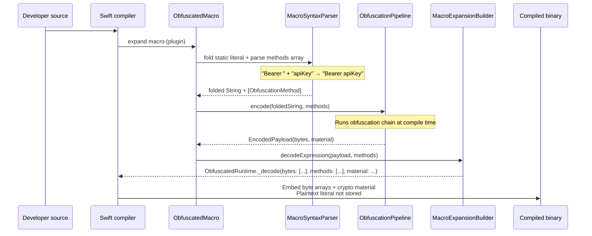
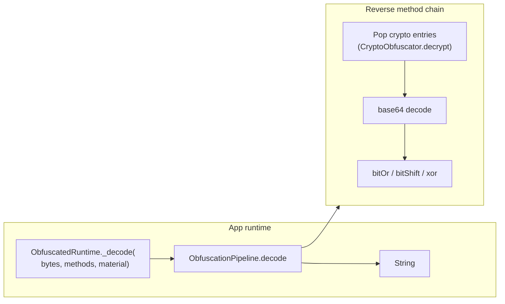
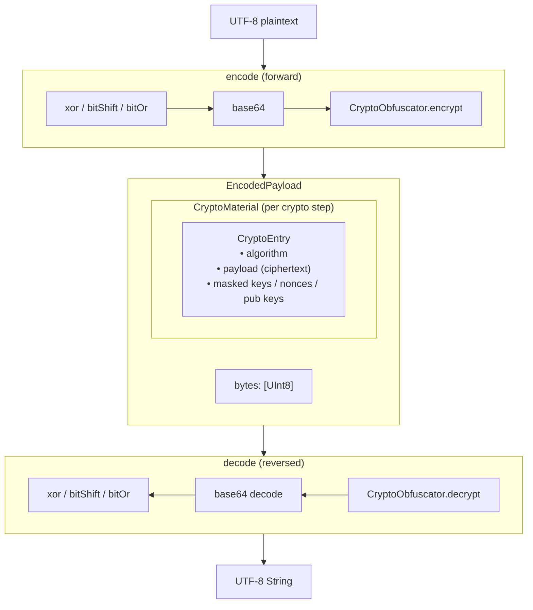
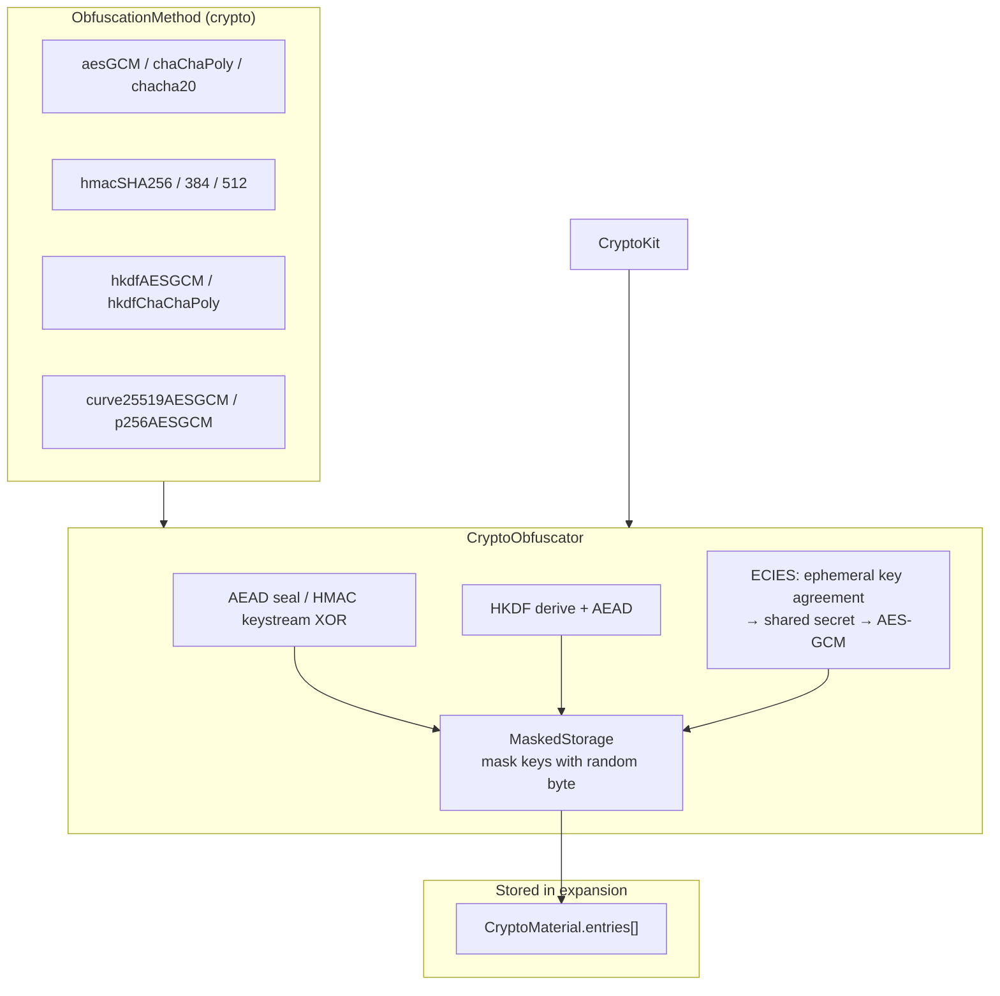
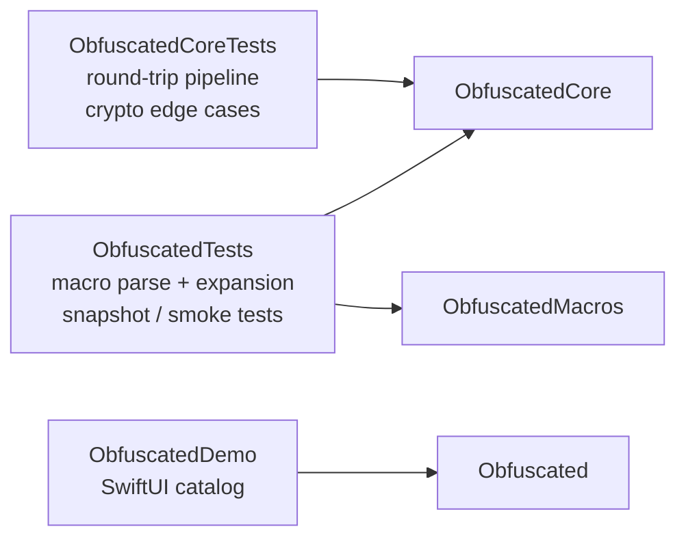

# Obfuscated — Architecture

← [Back to README](../README.md)

For the full source reference (every type, file, and algorithm), see [DOCUMENTATION.md](DOCUMENTATION.md).

## Module structure

```mermaid
flowchart TB
    subgraph Consumer["Consumer app (e.g. Demo)"]
        SRC["Source code\n#Obfuscated(\"secret\", methods: [...])\nor #Obfuscated(\"Bearer \\(\"token\")\", ...)"]
    end

    subgraph Product["Product: Obfuscated"]
        API["Obfuscated.swift\n• #Obfuscated\n• typealiases"]
    end

    subgraph Macros["ObfuscatedMacros (compiler plugin)"]
        PLUGIN["ObfuscatedPlugin"]
        PARSER["MacroSyntaxParser"]
        BUILDER["MacroExpansionBuilder"]
        EXPR["ObfuscatedMacro"]
    end

    subgraph Core["ObfuscatedCore"]
        PIPE["ObfuscationPipeline"]
        RUNTIME["ObfuscatedRuntime._decode"]
        METHODS["ObfuscationMethod\nObfuscatedKey / Nonce / Salt / Info"]
        MAT["CryptoMaterial\nCryptoEntry\nEncodedPayload"]
        BIT["BitwiseObfuscator"]
        B64["Base64Obfuscator"]
        CRYPTO["CryptoObfuscator\n(CryptoKit)"]
    end

    subgraph External["External"]
        SWIFT["Swift compiler"]
        CK["CryptoKit / Security"]
    end

    SRC --> API
    API --> SWIFT
    SWIFT --> PLUGIN
    PLUGIN --> EXPR
    EXPR --> PARSER --> BUILDER
    BUILDER --> PIPE
    PIPE --> BIT & B64 & CRYPTO
    CRYPTO --> CK
    BUILDER --> RUNTIME
    API --> RUNTIME
    RUNTIME --> PIPE
    PIPE --> METHODS & MAT
```

## Compile-time expansion



**What lands in the binary:** obfuscated `[UInt8]` payload, method descriptors, and masked `CryptoMaterial` — not the original string.

## Runtime decode



The app uses a normal `String`. Decode is hidden inside the macro expansion; callers never call `_decode` themselves.

## Obfuscation pipeline



## Crypto layer detail



## Test targets



## Summary

| Layer | Role |
|--------|------|
| **Obfuscated** | Public API surface; re-exports core types |
| **ObfuscatedMacros** | Compile-time plugin: parse → encode → emit `_decode(...)` |
| **ObfuscationPipeline** | Shared encode/decode engine for macro + runtime |
| **CryptoObfuscator** | CryptoKit-backed steps; keys stored masked in `CryptoMaterial` |
| **ObfuscatedRuntime** | Thin runtime entry point embedded by macro expansions |

**Design principle:** obfuscation happens at **compile time**; runtime only **reverses** the embedded byte payload to return an ordinary `String`.
