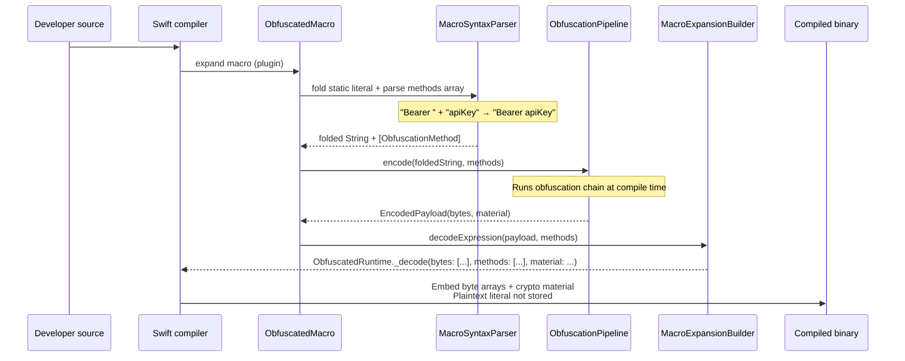
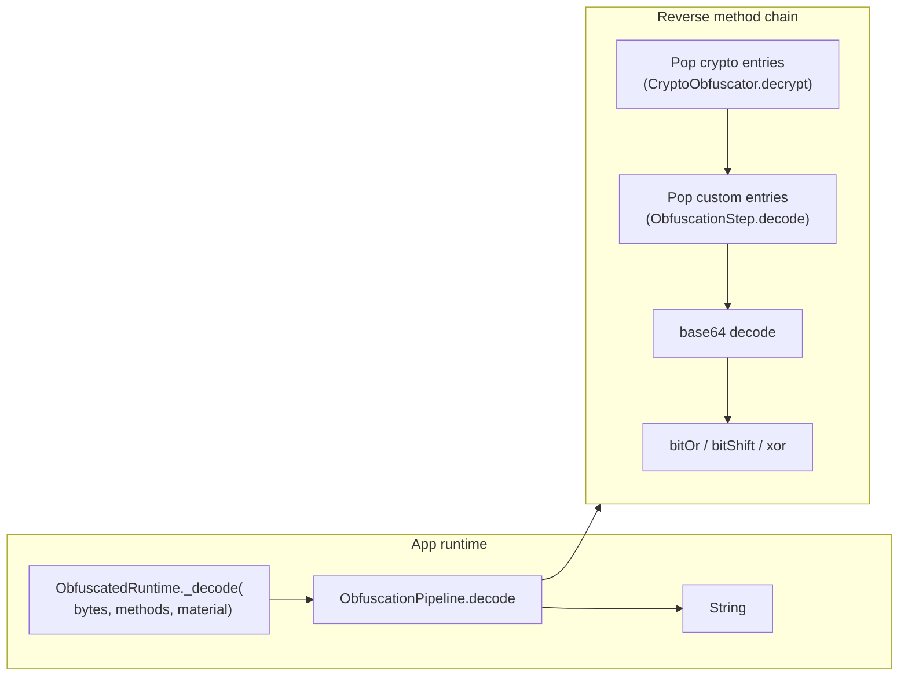
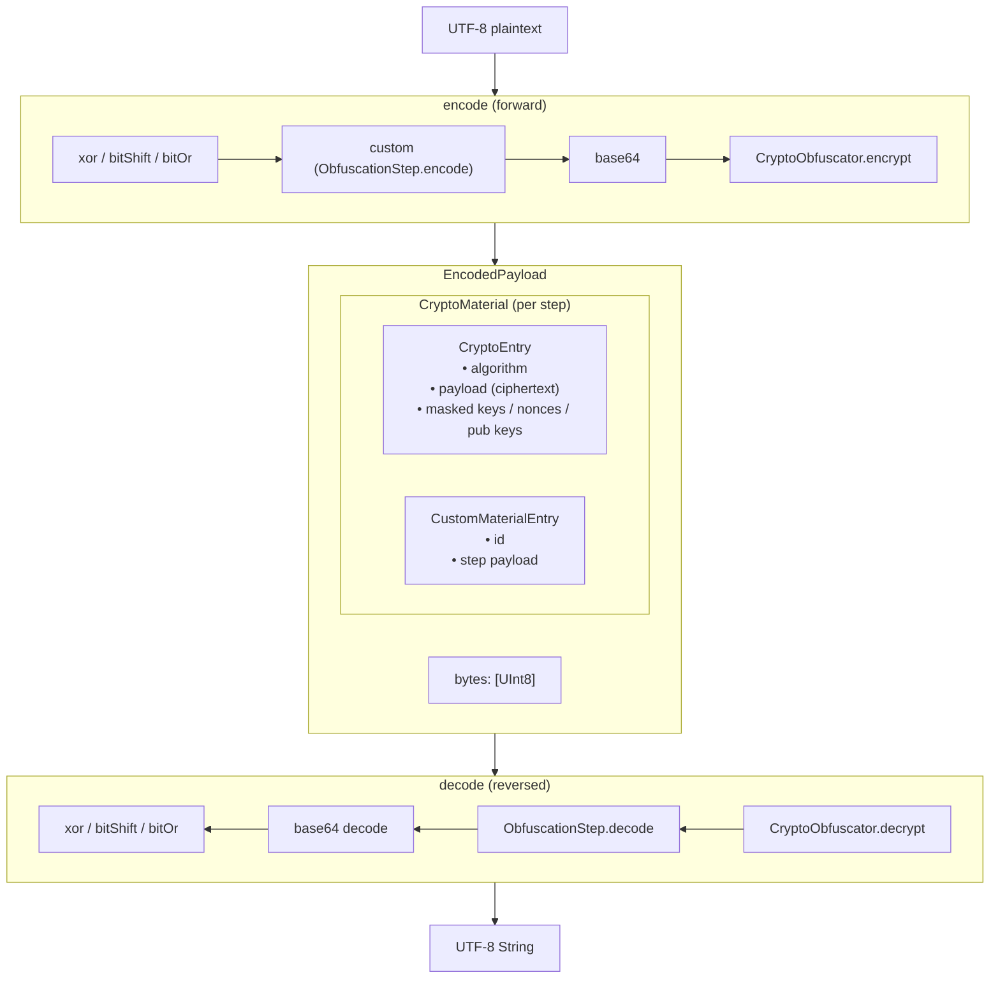
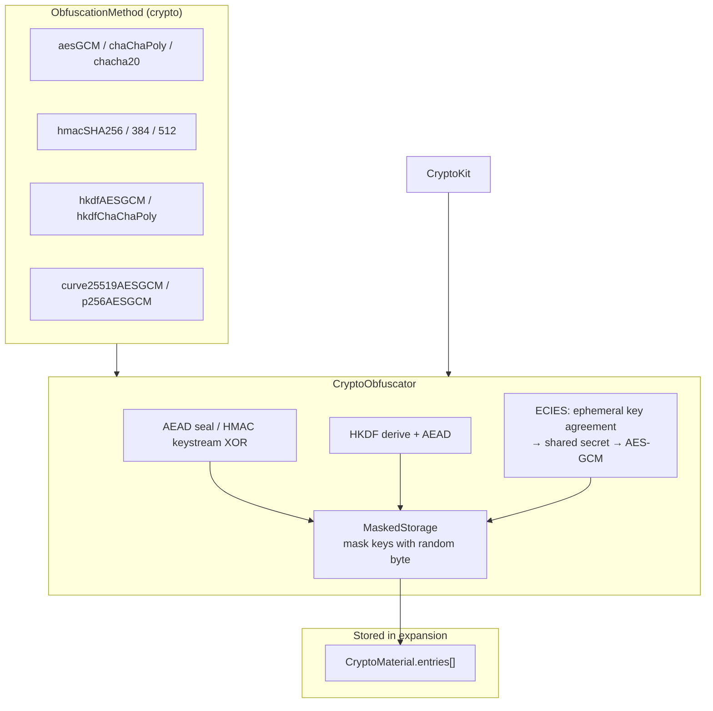
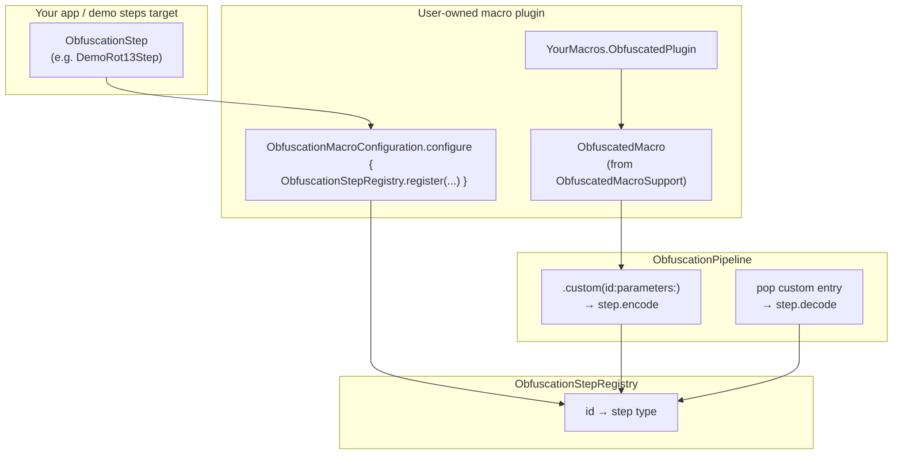
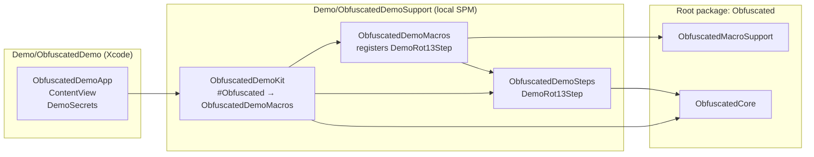
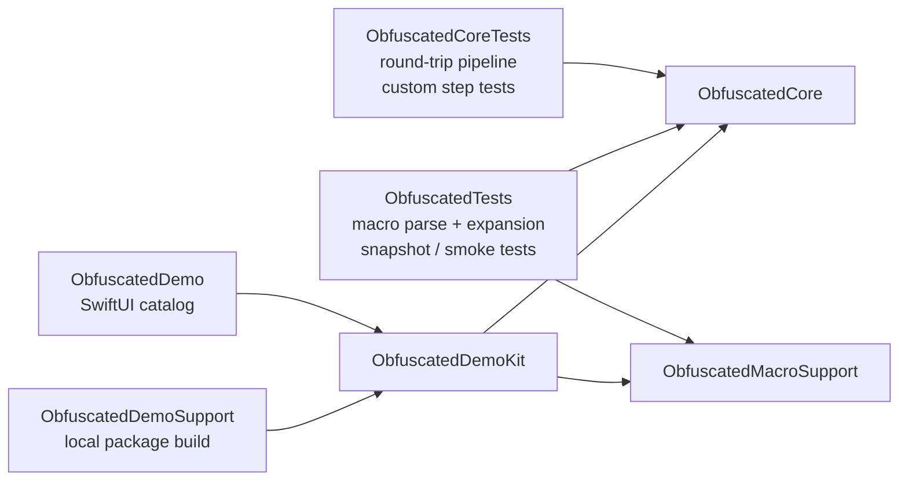

# Obfuscated — Architecture

← [Back to README](../README.md)

For the full source reference (every type, file, and algorithm), see [DOCUMENTATION.md](DOCUMENTATION.md).

## Module structure

```mermaid
flowchart TB
    subgraph Consumer["Consumer app"]
        SRC["Source code\n#Obfuscated(\"secret\", methods: [...])"]
    end

    subgraph Product["Product: Obfuscated"]
        API["Obfuscated.swift\n• #Obfuscated → ObfuscatedMacros\n• typealiases"]
    end

    subgraph MacroSupport["ObfuscatedMacroSupport (library)"]
        PARSER["MacroSyntaxParser"]
        BUILDER["MacroExpansionBuilder"]
        EXPR["ObfuscatedMacro"]
        CONFIG["ObfuscationMacroConfiguration"]
    end

    subgraph DefaultPlugin["ObfuscatedMacros (default plugin)"]
        PLUGIN["ObfuscatedPlugin\n(built-in methods only)"]
    end

    subgraph Core["ObfuscatedCore"]
        PIPE["ObfuscationPipeline"]
        RUNTIME["ObfuscatedRuntime._decode"]
        METHODS["ObfuscationMethod\nObfuscationStep / Registry"]
        MAT["CryptoMaterial\nCryptoEntry + CustomMaterialEntry"]
        BIT["BitwiseObfuscator"]
        B64["Base64Obfuscator"]
        CRYPTO["CryptoObfuscator\n(CryptoKit)"]
    end

    subgraph External["External"]
        SWIFT["Swift compiler"]
        CK["CryptoKit / Security"]
    end

    SRC --> API
    API --> SWIFT
    SWIFT --> PLUGIN
    PLUGIN --> CONFIG
    PLUGIN --> EXPR
    EXPR --> PARSER --> BUILDER
    BUILDER --> PIPE
    PIPE --> BIT & B64 & CRYPTO & METHODS
    CRYPTO --> CK
    BUILDER --> RUNTIME
    API --> RUNTIME
    RUNTIME --> PIPE
    PIPE --> METHODS & MAT
    CONFIG --> METHODS
```

**Default path:** `import Obfuscated` → `#Obfuscated` expands via `ObfuscatedMacros` (no custom steps registered).

**Custom steps path:** a user- or demo-owned macro plugin target links `ObfuscatedMacroSupport`, registers `ObfuscationStep` types in `ObfuscationMacroConfiguration.configure`, and exposes `#Obfuscated` via `#externalMacro(module: "YourMacros", ...)`. See [CUSTOM_OBFUSCATION_STEPS.md](CUSTOM_OBFUSCATION_STEPS.md) and the demo package below.

## Compile-time expansion



**What lands in the binary:** obfuscated `[UInt8]` payload, method descriptors, and masked `CryptoMaterial` — not the original string.

## Runtime decode



The app uses a normal `String`. Decode is hidden inside the macro expansion; callers never call `_decode` themselves.

## Obfuscation pipeline



## Crypto layer detail



## Custom obfuscation (optional)



Custom steps use ``ObfuscationMethod/custom(id:parameters:)`` in macro source. The plugin must register conforming types before expansion so compile-time `encode` can dispatch to them. Runtime `decode` uses the same registry (the demo app also registers at launch so decode works in the built binary).

## Demo layout



The demo support package is **not** part of the published root package — it exists only to show how to wire a custom macro plugin for the sample app.

## Test targets



## Summary

| Layer | Role |
|--------|------|
| **Obfuscated** | Public API surface; re-exports core types; default `#Obfuscated` → `ObfuscatedMacros` |
| **ObfuscatedMacroSupport** | Shared macro parser, builder, `ObfuscatedMacro`, and registration hook |
| **ObfuscatedMacros** | Default compiler plugin (built-in methods only) |
| **ObfuscationStep** | Optional user-defined transforms via `.custom(id:parameters:)` |
| **ObfuscationPipeline** | Shared encode/decode engine for macro + runtime |
| **CryptoObfuscator** | CryptoKit-backed steps; keys stored masked in `CryptoMaterial` |
| **ObfuscatedRuntime** | Thin runtime entry point embedded by macro expansions |
| **ObfuscatedDemoSupport** | Demo-only local package showing custom plugin wiring |

**Design principle:** obfuscation happens at **compile time**; runtime only **reverses** the embedded byte payload to return an ordinary `String`.
